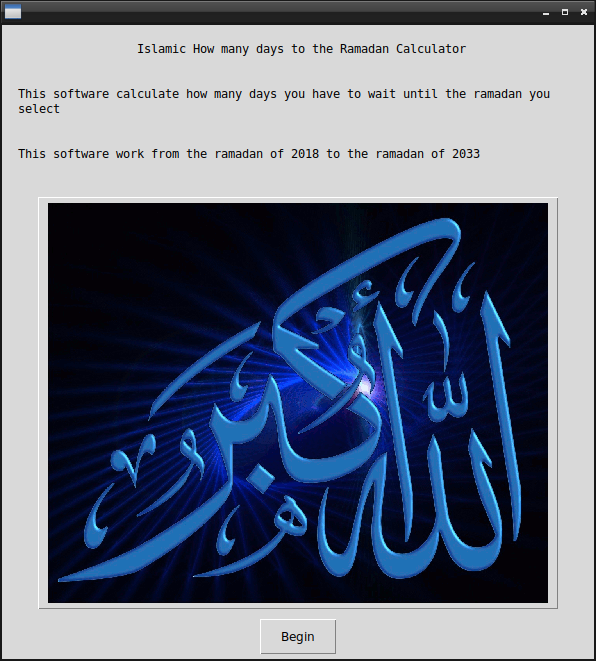
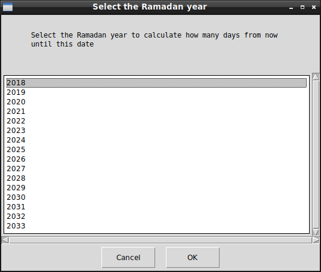
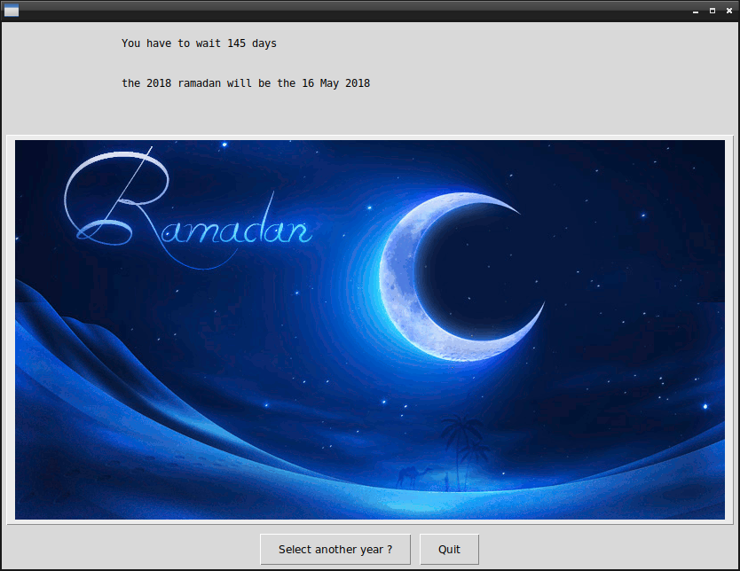

# Islamic how many days to the ramadan calculator with GUI  

## What's this software ?  

This software is developed in Python 3. It calculate how many days you have to wait until the ramadan you select.  
This software work from the ramadan of 2018 to the ramadan of 2033.  






## What you need to make it work :  

This game is made for Python 3.  

Install all the packages for : Python 3.  

easygui at least version 0.98  

```sh
sudo python3 -m pip install --upgrade easygui  
```  


## How to launch this software :  

```sh
python3 ramadanCalculator.py
```  


## Developer - Author  

Hamdy Abou El Anein  

